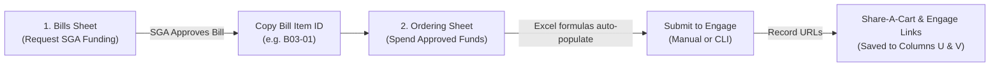

# MRG Finance

> Georgia Tech Marine Robotics Group — Financial Workflow & Automation Suite

**All purchasing begins in Excel on SharePoint. The CLI tool is optional.**

Master Workbook: **[FY27_Bills_Budget.xlsx on SharePoint](https://gtvault.sharepoint.com/:x:/r/sites/MarineRoboticsGroup/Shared%20Documents/OPS-1%20Operations/FY27%20Finances/FY27_Bills_Budget.xlsx?d=w89396907686c491395b64a5ef042181c&csf=1&web=1&e=b5knap)** (sign in with your GT account).

---

## 🔄 The Tandem Spreadsheet Workflow

The club's financial lifecycle operates in two sequential stages across two sheets:



### Sheet Comparison: `Bills` vs `Ordering`

| Attribute | 1. `Bills` Sheet (`BillsT`) | 2. `Ordering` Sheet (`OrderT`) |
| :--- | :--- | :--- |
| **Role** | **Where money comes from** (SGA funding approval). | **Where money goes** (Specific vendor order). |
| **One row represents…** | A product you want funded in an upcoming bill. | A product you are actively ordering right now. |
| **Row Grouping Key** | **`Bill Title`** (e.g. `RobotX Testing Equipment Bill`). | **`Order ID`** (`YYMMDD_vendor_gtusername`, e.g. `260910_amazon_gburdell3`). |
| **The Connecting Key** | **Defines `Bill Item ID`** (Col A, e.g. `B03-01`). | **Paste `Bill Item ID`** copied from `Bills` (Col B). |
| **What YOU fill in** | `Bill Title`, `Item Name`, `Vendor`, `Description`, `Budget Section` (`B03`/`B06`), `Quantity`, `Cost` (unit price), product `Link`, `Person Requesting`. | 1. Enter `Order ID` on every row in this cart<br>2. **Paste `Bill Item ID` from `Bills`**<br>3. Enter `Quantity` (to buy now), `Purchaser`, and `Status`. |
| **What EXCEL fills in** | `Bill Item ID` (Col A) and `Total Cost` (Col K). | **Everything else!** Bill No., Bill Title, Item Name, Vendor, Cost, Total Cost, Allocation, Budget Section via `=INDEX(MATCH(...))`. |
| **Golden Rule** | **Never type over formula columns (A & K).** | **Never type over lookup columns (C–G, I–J, O).** Only paste the `Bill Item ID`! |
| **After Submission** | Once SGA passes the bill, record the official **`Bill No.`** on all item rows. | Paste **`Share-A-Cart Link`** (Col U) and **`Engage Request Link`** (Col V) across all order rows. |

---

## 🚀 How to Submit: 2 Options

### Option A: Submit Manually on Engage (No Software Installation)

1. **For Budget / Bill Requests:**
   - Open [MRG Budgeting in Engage](https://gatech.campuslabs.com/engage/actionCenter/organization/MRG/budgeting) and create a draft with your `Bill Title`.
   - Add items under their respective budget sections (`B03 - General Inventoried Goods` for assets/tools; `B06 - Non-Inventoried Items` for consumables/supplies).
   - Attach a product screenshot for each item showing name and unit price. Submit, then write the assigned `Bill No.` into Excel.
2. **For Purchase Requests:**
   - Build your vendor cart and take a cart screenshot (`cart.png`).
   - Open [Create Purchase Request in Engage](https://gatech.campuslabs.com/engage/actionCenter/organization/MRG/Finance/CreatePurchaseRequest).
   - Enter vendor, amount, funding account, and approved SGA bill & line numbers.
   - Attach `cart.png` and a Budget vs Quoted comparison spreadsheet, sign, and submit.
   - Paste the confirmation URL into **`Engage Request Link`** (Col V) and cart link into **`Share-A-Cart Link`** (Col U) on all order rows.

📖 *Full field-by-field instructions: [Spreadsheet & Manual Workflow Guide](docs/user/WORKFLOW_GUIDE.md).*

---

### Option B: Use the Automated CLI (`mrg-finance`)

The command-line tool automates screenshot verification, live price checking, comparison report generation, and Engage form filling. *(You still review in the browser and click Submit yourself.)*

#### Quick CLI Reference

Always verify your spreadsheet before submitting:
```bash
mrg-finance doctor --fresh
```

| Task | Command | Description |
| :--- | :--- | :--- |
| **Bill Request** | `mrg-finance bill-request --fresh` | Audits quote screenshots and autofills line items into your Engage budget draft. |
| **Purchase Request** | `mrg-finance purchase --fresh` | Checks prices, opens vendor cart, creates comparison Excel sheet, and autofills Engage form. |
| **Report Only** | `mrg-finance report --fresh` | Generates `Budget_vs_Quoted_Detail_<Order ID>.xlsx` for your order without browser automation. |
| **Visual Review** | `mrg-finance review --bill "<Title>"` | Launches local side-by-side card GUI (`http://localhost:8321`) to inspect screenshots and diff prices. |

> [!NOTE]
> In a purchase run, press **Enter** in your terminal only after you click **Submit** on Engage. The tool will capture or prompt for your confirmation URL and automatically save both links back to SharePoint.

<details>
<summary><b>First-Time CLI Installation & SharePoint Setup</b></summary>

Install [uv](https://docs.astral.sh/uv/getting-started/installation/) and install `mrg-finance` globally:

```bash
# macOS / Linux:
curl -LsSf https://astral.sh/uv/install.sh | sh
uv tool install --python 3.12 git+https://github.com/gt-marine-robotics-group/finance.git
uv tool update-shell

# Windows PowerShell:
irm https://astral.sh/uv/install.ps1 | iex
uv tool install --python 3.12 git+https://github.com/gt-marine-robotics-group/finance.git
uv tool update-shell
```

**Connect SharePoint via `rclone` (One-time):**
1. Install [rclone](https://rclone.org/install/) and run `rclone config`.
2. Create remote named `onedrive` &rarr; type **Microsoft OneDrive** &rarr; complete GT SSO & Duo login in browser &rarr; select **SharePoint site** (`https://gtvault.sharepoint.com/sites/MarineRoboticsGroup`) &rarr; select **Documents**.
3. Verify connection:
   ```bash
   rclone ls "onedrive:OPS-1 Operations/FY27 Finances"
   ```

**Working Directory:**
Create a dedicated folder (e.g. `~/mrg-finance-work`), download `FY27_Bills_Budget.xlsx` into it, and set:
```bash
# macOS / Linux:
export FINANCE_XLSX_PATH="$PWD/FY27_Bills_Budget.xlsx"

# Windows PowerShell:
$env:FINANCE_XLSX_PATH = Join-Path (Get-Location).Path "FY27_Bills_Budget.xlsx"
```

</details>

<details>
<summary><b>Troubleshooting & Common Fixes</b></summary>

- **`mrg-finance: command not found`:** Run `uv tool update-shell`, then restart your terminal.
- **Lookup columns show `#N/A`:** The `Bill Item ID` entered in `Ordering` does not match any ID in `Bills`. Copy it directly from Column A of `Bills`.
- **`rclone` size or hash mismatch warnings:** Normal SharePoint behavior; tool automatically passes `--ignore-checksum --ignore-size --update`.
- **Duo MFA times out:** You have 180 seconds to approve the push. Keep your mobile device unlocked.
- **Form question structure changed on Engage:** Purchase automation safely falls back to pasting unmapped breakdown lines into the main **Description** box.

📖 *Full troubleshooting guide: [CLI & Troubleshooting Guide](docs/user/CLI_GUIDE.md).*

</details>

---

## 📚 Documentation Index

| Category | Document | Description |
| :--- | :--- | :--- |
| **User Guides** | [Spreadsheet & Manual Workflow Guide](docs/user/WORKFLOW_GUIDE.md) | Full schema, tandem lifecycle, formula rules, and manual Engage submission |
| | [CLI & Troubleshooting Guide](docs/user/CLI_GUIDE.md) | Installation, rclone setup, CLI command reference, and error troubleshooting |
| **Development** | [Developer & Web App Guide](docs/dev/DEVELOPMENT.md) | System architecture, SIM PC deployment, systemd, and Microsoft Graph API |
| **AI Assistants** | [AI Agent Guidelines](docs/agents/agents.md) | Agent system specifications, spreadsheet safety rules, and operational blueprints |
| | [Technical Changelog](docs/agents/agent_changes.md) | Chronological development record, refactors, and regression post-mortems |
