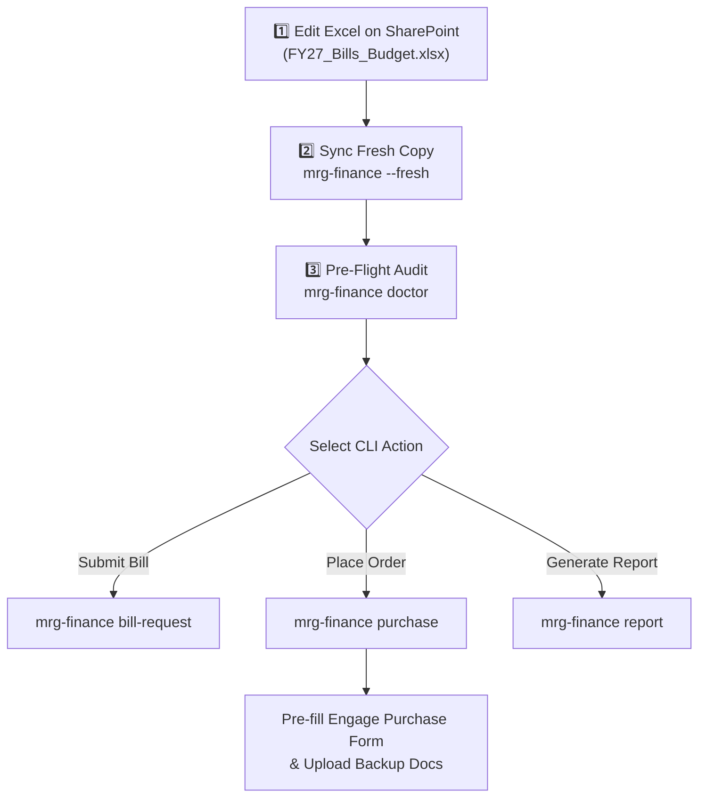

# ⚓ Georgia Tech MRG Finance & Purchasing System

Automated bill request submission, purchase request automation, live price auditing, and budget spreadsheet management for the **Georgia Tech Marine Robotics Group**.

---

## 🛠️ Quick Setup & Installation

### 1. Install `uv` Package Manager & CLI Tool

This repository exclusively uses [`uv`](https://docs.astral.sh/uv/getting-started/installation/) as the package and environment manager.

#### 🍎 macOS / 🐧 Linux Setup:
```bash
# 1. Install uv
curl -LsSf https://astral.sh/uv/install.sh | sh

# 2. Install mrg-finance CLI tool globally
uv tool install git+https://github.com/gt-marine-robotics-group/finance.git
```

#### 🪟 Windows Setup (PowerShell):
```powershell
# 1. Install uv package manager
powershell -ExecutionPolicy ByPass -c "irm https://astral.sh/uv/install.ps1 | iex"

# 2. Install mrg-finance CLI tool globally
uv tool install git+https://github.com/gt-marine-robotics-group/finance.git
```

> 💡 **PATH Environment Note for Windows**: Ensure `%USERPROFILE%\.local\bin` is in your User Environment `PATH` variable so `mrg-finance` runs directly in PowerShell or Command Prompt.
> 📖 **Official `uv` Installation Guide**: [https://docs.astral.sh/uv/getting-started/installation/](https://docs.astral.sh/uv/getting-started/installation/)

*(For local editable developer setup, run `git clone git@github.com:gt-marine-robotics-group/finance.git && cd finance && uv venv && source .venv/bin/activate && uv pip install -e .`)*

---

### 2. Browser & Cloud Sync Prerequisites

1. **Google Chrome**: Required for web scraping and CampusLabs Engage form submission.
   - **macOS**: `brew install --cask google-chrome`
   - **Linux**: `sudo apt install chromium-browser`
   - **Windows**: Install [Google Chrome for Windows](https://www.google.com/chrome/).
2. **SharePoint Cloud Sync (`rclone`)**:
   - **macOS**: `brew install rclone`
   - **Linux**: `sudo apt install rclone`
   - **Windows (PowerShell)**: `winget install rclone.rclone`
   - Configure GT OneDrive remote (`onedrive`):
     ```bash
     rclone config
     # New remote (n) -> Name: onedrive -> Storage: 42 (OneDrive) -> Auth with GT SSO -> SharePoint Site: https://gtvault.sharepoint.com/sites/MarineRoboticsGroup -> Drive: Documents (3)
     ```
   - Verify: `rclone ls "onedrive:OPS-1 Operations/FY27 Finances"`

> ⚠️ **WARNING / IMPORTANT**:
> Configuring `rclone` to sync GT OneDrive / SharePoint involves multi-factor authentication (GT SSO + Duo MFA) and specific remote settings. If you encounter any issues during this configuration step, **ask a finance officer or team lead for help**!

---

## 📊 Master Budget Spreadsheet Workflow (`FY27_Bills_Budget.xlsx`)

The entire purchasing and bill submission pipeline is driven by the team's shared **FY27 Master Budget Spreadsheet** on SharePoint.

🔗 **Direct SharePoint Link**: [FY27_Bills_Budget.xlsx (SharePoint Web View)](https://gtvault.sharepoint.com/:x:/r/sites/MarineRoboticsGroup/Shared%20Documents/OPS-1%20Operations/FY27%20Finances/FY27_Bills_Budget.xlsx?d=w89396907686c491395b64a5ef042181c&csf=1&web=1&e=b5knap)

---

### 📑 Key Sheets & Structure

| Sheet Name | Role & Purpose | Key Columns & Requirements |
| :--- | :--- | :--- |
| 📜 **`Bills`** | **Master Approved Line Items**<br>Defines all approved SGA bill line items. Every item gets a unique `Bill Item ID`. | • **`Bill Item ID`**: Unique identifier (e.g., `376851_1`)<br>• **`Bill No.`**: SGA Bill Number (e.g., `376851`)<br>• **`Item Name`**: Line item description<br>• **`Budget Section`**: Category (e.g., `B03 - General Inventoried Goods`)<br>• **`Cost`**: Approved unit allocation price<br>• **`Link`**: Direct product URL (Amazon, McMaster, DigiKey) |
| 🛒 **`Ordering`** | **Order Groupings (`OrderT`)**<br>Groups line items from `Bills` into vendor purchase orders under an `Order ID`. | • **`Order ID`**: Unique order string (e.g., `260811_amazon_awu335`)<br>• **`Bill Item ID`**: References target line item in `Bills` sheet<br>• **`Quantity`**: Number of units to order<br>• **`Vendor`**: Supplier name (e.g., `Amazon`, `McMaster-Carr`) |

---

### 🔄 End-to-End Tandem Workflow



#### Step-by-Step Interface Guide for Team Members:

1. **Step 1: Adding Approved Line Items (`Bills` sheet)**:
   - Open [FY27_Bills_Budget.xlsx on SharePoint](https://gtvault.sharepoint.com/:x:/r/sites/MarineRoboticsGroup/Shared%20Documents/OPS-1%20Operations/FY27%20Finances/FY27_Bills_Budget.xlsx?d=w89396907686c491395b64a5ef042181c&csf=1&web=1&e=b5knap).
   - Navigate to the **`Bills`** sheet. Add a new row with a unique `Bill Item ID` (e.g. `376851_1`), SGA `Bill No.`, item description, budget section, approved unit cost, and product link.

2. **Step 2: Grouping Line Items into Orders (`Ordering` sheet)**:
   - Navigate to the **`Ordering`** sheet.
   - Create a new `Order ID` (format: `YYMMDD_<vendor>_<gt_username>`, e.g., `260811_amazon_awu335`).
   - List the `Bill Item ID`s and quantities to order for each item.

3. **Step 3: Running Pre-Flight Audit & Report Generation**:
   - Run `mrg-finance doctor --fresh` to pull the latest SharePoint Excel edits and verify that all `Bill Item ID` references, product URLs, and prices are valid.
   - Run `mrg-finance report --fresh --order <ORDER_ID>` to generate the side-by-side **Budget vs Quoted** Excel report (`.xlsx`) containing live formulas and subtotal calculations.

4. **Step 4: Executing Purchase Request Automation**:
   - Run `mrg-finance purchase --fresh --order <ORDER_ID>`.
   - The CLI performs a live price audit against vendor URLs, auto-builds an Amazon multi-item cart URL, captures cart screenshot evidence (`cart.png`), and pre-fills CampusLabs Engage purchase forms with exact section and line numbers.

5. **Step 5: Web Dashboard & Review GUI Alternative**:
   - Alternatively, launch the Web Dashboard (`http://localhost:5000`) or Side-by-Side Review Inspector (`http://localhost:8321`). Any price adjustments or item edits saved through the GUI automatically write back to `FY27_Bills_Budget.xlsx` using openpyxl while preserving all existing Excel formulas (`SUM`, `IFERROR`) and formatting.

---

## 🤖 CLI Usage & Workflows (`mrg-finance`)

```bash
Usage:
    mrg-finance report [--fresh] [--order ORDER_ID] [--skip-scrape]
    mrg-finance doctor [--fresh]
    mrg-finance bill-request [--fresh]
    mrg-finance purchase [--fresh] [--order ORDER_ID]
    mrg-finance review [--bill TITLE]
    mrg-finance price-check [--fresh] [--bill TITLE] [--cart]
    mrg-finance screenshots [--fresh] [--bill TITLE] [--review-only]
```

### 📋 Subcommands & Flags Cheat Sheet

| Subcommand | Supported Flags | Purpose & Description | macOS / Linux & Windows Example |
| :--- | :--- | :--- | :--- |
| **`report`** | `--fresh` (`-f`), `--order` (`-o`), `--skip-scrape` | Generates side-by-side Budget vs Quoted Excel & CSV reports with live formulas. | `mrg-finance report --fresh --order 260811_amazon_awu335` |
| **`doctor`** | `--fresh` (`-f`) | Pre-flight audit checking duplicate IDs, broken links, $0 allocations & row offsets. | `mrg-finance doctor --fresh` |
| **`purchase`** | `--fresh` (`-f`), `--order` (`-o`) | Audits prices, builds 1-Click Amazon cart, captures `cart.png`, & pre-fills Engage forms. | `mrg-finance purchase --fresh --order 260811_amazon_awu335` |
| **`bill-request`** | `--fresh` (`-f`) | Submits draft budget bills to CampusLabs Engage for SGA approval. | `mrg-finance bill-request --fresh` |
| **`review`** | `--bill` (`-b`) | Launches interactive side-by-side review GUI at `http://localhost:8321`. | `mrg-finance review --bill "Testing Equipment"` |
| **`price-check`** | `--fresh` (`-f`), `--bill` (`-b`), `--cart` (`-c`) | Headless price audit comparing live online prices against budget allocations. | `mrg-finance price-check --fresh --cart` |
| **`screenshots`** | `--fresh` (`-f`), `--bill` (`-b`), `--review-only` (`-r`) | Scrapes prices via headless Chrome & captures full-page screenshot evidence. | `mrg-finance screenshots --fresh` |

> 🪟 **Windows PowerShell Note**: All `mrg-finance` CLI subcommands run identically in **Windows PowerShell** or Command Prompt once `%USERPROFILE%\.local\bin` is added to your environment `PATH`.

---

### 1. `mrg-finance report` — Generate Budget vs Quoted Excel & CSV Reports

Generates a side-by-side **Budget Request vs Quoted Line Items** comparison report containing live Excel formulas (`=E*F`, `=H*I`, `=SUM(...)`), subtotal rows, and grand totals for attachment to Engage purchase requests.

```bash
# Generate report for a specific order:
mrg-finance report --order 260811_amazon_awu335

# Sync fresh spreadsheet from SharePoint first:
mrg-finance report --fresh --order 260811_amazon_awu335

# Interactive order selection:
mrg-finance report
```
*Output files: `screenshots/<order_id>/Budget_vs_Quoted_Detail_<order_id>.xlsx` and `.csv`.*

---

### 2. `mrg-finance doctor` — Pre-Flight Spreadsheet Health Audit

Runs a pre-flight health diagnostic audit on `FY27_Bills_Budget.xlsx` before running bill or purchase request submissions.

```bash
mrg-finance doctor
mrg-finance doctor --fresh
```

#### What `mrg-finance doctor` checks:
- 🔍 **Duplicate Item IDs**: Flags duplicate `Bill Item ID`s across sheets.
- 🔗 **Broken Order References**: Identifies `OrderT` rows referencing missing `Bill Item ID`s.
- 🌐 **Invalid or Missing Links**: Flags items missing product URLs or containing malformed links.
- 💵 **$0.00 Cost Allocations**: Highlights approved items allocated with `$0.00` cost.
- 📄 **Sheet & Header Offsets**: Scans top 10 rows to detect header shifts and verifies required sheets.

---

### 3. `mrg-finance purchase` — Automated Purchase Requests

Submits purchase requests to CampusLabs Engage grouped by vendor from `OrderT`.

```bash
mrg-finance purchase --fresh
mrg-finance purchase --fresh --order "260811_amazon_awu335"
```
**Workflow**: Audits live prices ➔ Builds 1-Click Amazon Multi-Item Cart URL ➔ Captures `cart.png` ➔ Auto-generates Budget vs Quoted Excel detail report ➔ Pre-fills Engage Purchase Request form in Chrome.

---

### 4. `mrg-finance bill-request` — Submit Bill to CampusLabs Engage

Automates submitting a new draft budget bill to CampusLabs Engage for SGA approval.

```bash
mrg-finance bill-request --fresh
```
**Workflow**: Scrapes live prices ➔ Verifies screenshot evidence ➔ Launches side-by-side inspector ➔ Pre-fills Engage bill form sections.

---

### 5. `mrg-finance review` — Instant Side-by-Side Review

Launches the interactive side-by-side screenshot & price review GUI at `http://localhost:8321` **without running web scraping or opening Chrome automation**.

```bash
mrg-finance review
mrg-finance review --bill "Marine Robotics Group RobotX Testing Equipment Bill"
```

---

### 6. `mrg-finance price-check` — Budget Overrun Audit

Checks live vendor online prices against approved budget allocations.

```bash
mrg-finance price-check --fresh --bill "FY27 Budget" --cart
```

---

### 7. `mrg-finance screenshots` — Scrape Prices & Capture Evidence

Scrapes product prices via headless Chrome and captures full-page product screenshots.

```bash
mrg-finance screenshots --fresh
mrg-finance screenshots --bill "FY27 Budget"
```

---

## 🗺️ System Architecture & Code Map

<details>
<summary><b>📁 Expand Complete Repository Architecture</b></summary>

- **`mrg.py`**: Main CLI entrypoint for `mrg-finance` commands.
- **`automation.py`**: SGA Bill Request Engage form automation (Priority 1).
- **`automation_purchase.py`**: Purchase Request Engage form automation (Priority 2).
- **`order_excel_builder.py`**: Side-by-side Budget vs Quoted Excel (`.xlsx`) & CSV report generator.
- **`engage_bill_lookup.py`**: Engage DOM scraper module for section names and 1-based section line numbers.
- **`engage_tools.py`**: Shared Selenium browser helper functions for GT SSO login and Duo MFA.
- **`price_scraper.py`**: Multi-vendor live price scraper (Amazon, McMaster, DigiKey, Mouser, Adafruit, SparkFun, Pololu).
- **`spreadsheet_utils.py`**: Robust Excel loader, dynamic header row detector, and `validate_budget_spreadsheet()` health auditor.
- **`review_server.py`**: Micro HTTP server on port 8321 serving side-by-side review GUI.
- **`web-app/`**: Flask web application dashboard (`http://localhost:5000`).

For detailed student instructions, see [`USAGE_GUIDE.md`](USAGE_GUIDE.md). For developer architecture details, see [`DEVELOPMENT.md`](DEVELOPMENT.md).

</details>

---

## 📚 Complete Documentation Index

| Guide | Description |
| :--- | :--- |
| 🚀 [**README.md**](README.md) | Quick start, installation, Chrome/rclone setup, Excel SharePoint links, and CLI command summary. |
| 📊 [**SPREADSHEET_GUIDE.md**](SPREADSHEET_GUIDE.md) | Deep-dive guide on `FY27_Bills_Budget.xlsx`, `Bills` vs `Ordering` schema, formula rules, and `mrg-finance doctor` audit rules. |
| 📘 [**USAGE_GUIDE.md**](USAGE_GUIDE.md) | Student & officer usage guide for bill requests, purchase requests, Amazon multi-cart links, and Engage forms. |
| 🔍 [**TROUBLESHOOTING.md**](TROUBLESHOOTING.md) | Troubleshooting & FAQ guide for `rclone` sync errors, Chrome/Selenium issues, Duo MFA, and CLI setup. |
| 💻 [**DEVELOPMENT.md**](DEVELOPMENT.md) | Developer architecture guide, Flask blueprints, database schemas, and unit test suite documentation. |
