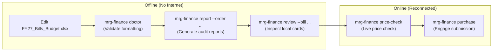

# ⚓ MRG Finance Automation Suite

Automated budget management, live price auditing, quotation comparisons, screenshot capture, and CampusLabs Engage submissions for the **Georgia Tech Marine Robotics Group**.

All team purchasing begins in the master shared workbook:
👉 **[FY27_Bills_Budget.xlsx on SharePoint](https://gtvault.sharepoint.com/:x:/r/sites/MarineRoboticsGroup/Shared%20Documents/OPS-1%20Operations/FY27%20Finances/FY27_Bills_Budget.xlsx?d=w89396907686c491395b64a5ef042181c&csf=1&web=1&e=b5knap)** *(sign in with your `@gatech.edu` account)*.

---

## 📑 Table of Contents
1. [Installation from Scratch](#-installation-from-scratch)
2. [Complete Uninstall & Reset](#-complete-uninstall--reset)
3. [Working Outside of rclone (Manual & Direct Workflows)](#-working-outside-of-rclone-manual--direct-workflows)
4. [Working Completely Offline (Air-Gapped / No Internet)](#-working-completely-offline-air-gapped--no-internet)
5. [Optional: Automated SharePoint Sync (rclone)](#-optional-automated-sharepoint-sync-rclone)
6. [Running Tests from Scratch](#-running-tests-from-scratch)
7. [CLI Commands Reference](#-cli-commands-reference)
8. [Spreadsheet Workflow Guide](#-spreadsheet-workflow-guide)
9. [Mobile Purchasing Web App](#-mobile-purchasing-web-app)
10. [Troubleshooting & FAQs](#-troubleshooting--faqs)

---

## 🚀 Installation from Scratch

Choose either **Option A** (recommended for general members) or **Option B** (for developers contributing code):

### Option A: Global CLI Install via `uv` (Recommended)
Installs `mrg-finance` into an isolated environment and exposes the CLI command directly to your PATH:

```bash
# 1. Install uv (if not already installed)
# macOS / Linux:
curl -LsSf https://astral.sh/uv/install.sh | sh
# Windows PowerShell:
irm https://astral.sh/uv/install.ps1 | iex

# 2. Install mrg-finance globally directly from GitHub
uv tool install git+https://github.com/gt-marine-robotics-group/finance.git

# 3. Verify installation
mrg-finance --help
```

To update to the latest version at any time:
```bash
uv tool install --force --refresh git+https://github.com/gt-marine-robotics-group/finance.git
```

### Option B: Local Repository Setup (Developers)
```bash
# 1. Clone the repository
git clone https://github.com/gt-marine-robotics-group/finance.git
cd finance

# 2. Install dependencies into virtual environment
uv sync

# 3. Verify CLI execution
uv run mrg-finance --help
```

---

## 🧹 Complete Uninstall & Reset

If you want to uninstall `mrg-finance` or reset your environment to a 100% clean state:

```bash
# 1. Uninstall the global CLI tool
uv tool uninstall mrg-finance

# 2. Uninstall any pip packages (if installed previously via pip)
pip uninstall -y mrg-finance

# 3. Verify binary is completely removed
which mrg-finance  # Should return empty or 'not found'

# 4. (Optional) Reset rclone SharePoint connection
rclone config delete onedrive
# Or delete the config file entirely: rm -f ~/.config/rclone/rclone.conf

# 5. Clean local virtual environments, test caches, and build artifacts
rm -rf .venv build dist *.egg-info __pycache__ mrg_finance/__pycache__ .pytest_cache review.html
```

---

## 📁 Working Outside of rclone (Manual & Direct Workflows)

You **do not need `rclone`** to use `mrg-finance`. `rclone` is strictly optional convenience automation invoked only when passing the `--fresh` (`-f`) flag.

If you prefer not to set up `rclone`, simply **omit `--fresh` from all commands**. The CLI uses a built-in search hierarchy to locate your spreadsheet automatically:

### 1. Spreadsheet Auto-Discovery Hierarchy
The CLI checks the following locations in order:
1. **Current Working Directory**: `./FY27_Bills_Budget.xlsx`
2. **Repository Root**: `~/mrg/finance/FY27_Bills_Budget.xlsx`
3. **Native Desktop OneDrive Sync** *(Mac/Windows)*:
   - macOS: `~/Library/CloudStorage/OneDrive-GeorgiaInstituteofTechnology/Documents - Marine Robotics Group/OPS-1 Operations/FY27 Finances/FY27_Bills_Budget.xlsx`
   - Windows: Automatically detected in your user OneDrive sync root.
4. **Custom Path Environment Variable**:
   You can point the CLI to any file on your computer by setting:
   ```bash
   export FINANCE_XLSX_PATH="/path/to/my_custom_budget.xlsx"
   ```

### 2. Manual Workflow Without `rclone`
* **Getting the Spreadsheet**:
  1. Open [FY27_Bills_Budget.xlsx on SharePoint](https://gtvault.sharepoint.com/:x:/r/sites/MarineRoboticsGroup/Shared%20Documents/OPS-1%20Operations/FY27%20Finances/FY27_Bills_Budget.xlsx?d=w89396907686c491395b64a5ef042181c&csf=1&web=1&e=b5knap) in your browser.
  2. Click **File > Save As > Download a Copy** (`FY27_Bills_Budget.xlsx`).
  3. Move it into your working folder or repo root.
* **Running Commands**:
  Run CLI commands directly without `--fresh`:
  ```bash
  mrg-finance doctor
  mrg-finance price-check --bill "Marine Robotics Group RobotX Testing Equipment Bill"
  mrg-finance report --order 260811_amazon_awu335
  mrg-finance review --bill "Marine Robotics Group RobotX Testing Equipment Bill"
  ```
* **Saving Changes Back to the Team**:
  - If you edit the spreadsheet locally in Excel, drag and drop the updated file back to SharePoint to replace it.
  - Or, if you use the native Microsoft OneDrive desktop sync client, changes sync automatically in the background without needing any CLI commands.
* **Managing Screenshots**:
  - The CLI saves all captured screenshots locally to `screenshots/<bill_or_order_name>/`.
  - You can manually drag and drop this folder into the SharePoint web folder `OPS-1 Operations/FY27 Finances/screenshots`.

---

## ✈️ Working Completely Offline (Air-Gapped / No Internet)

If you are traveling, working in the field without internet, or on an air-gapped machine, the tool continues to function offline.

### What Works 100% Offline:
1. **Spreadsheet Health Audits (`mrg-finance doctor`)**:
   - Evaluates local `.xlsx` files using `openpyxl` and `pandas`.
   - Validates row formulas, non-zero costs, missing bill numbers, and formatting without making any network requests.
2. **The Entire Automated Test Suite (`uv run pytest`)**:
   - Constructs deterministic in-memory mock workbooks and verifies all 8 simulated workflows completely offline in ~1 second.
3. **Audit Report Generation (`mrg-finance report --order <ID>`)**:
   - Reads your local `Ordering` sheet and generates formatted comparison `.xlsx` and `.csv` audit spreadsheets in `screenshots/<order_id>/`.
   - **Offline Scrape Fallback**: If vendor websites are unreachable because you are offline, the reporting engine automatically falls back to your budgeted baseline costs to ensure report generation never fails.
4. **Local Review GUI (`mrg-finance review --bill "..."`)**:
   - Starts a lightweight local web server on `http://127.0.0.1:8321` that serves cached local screenshots and pricing cards offline.
5. **Local Spreadsheet Editing**:
   - Open and edit `FY27_Bills_Budget.xlsx` offline in Microsoft Excel, LibreOffice, or Apple Numbers.

### What Requires an Internet Connection:
* **Live Price Scraping (`price-check`, `screenshots`)**: Scraping current prices from Amazon or vendor websites requires internet connectivity.
* **Automated Engage Submissions (`bill-request`, `purchase`)**: Logging into Georgia Tech's CampusLabs Engage portal requires internet access and Duo 2FA.

### Recommended Offline-to-Online Protocol:

1. **While Offline**: Edit your rows, run `mrg-finance doctor` to confirm formatting is valid, and run `mrg-finance report` to compile comparison reports.
2. **Once Back Online**: Run `mrg-finance price-check` to verify live prices, and execute `mrg-finance purchase` or `mrg-finance bill-request` to submit directly to Engage (or upload manually).

---

## ☁️ Optional: Automated SharePoint Sync (`rclone`)

If you want the CLI to automatically download the latest spreadsheet and upload captured screenshots directly to Georgia Tech SharePoint using the `--fresh` flag, configure `rclone` once:

### 1. Install `rclone`
* **macOS**: `brew install rclone`
* **Linux**: `sudo -v ; curl https://rclone.org/install.sh | sudo bash`
* **Windows**: `winget install Rclone.Rclone`

### 2. Configure the GT SharePoint Remote
Run the interactive wizard in your terminal:
```bash
rclone config
```

Respond to the prompts as follows (select options by **name**, not number):

| Prompt | What to Enter / Select |
| :--- | :--- |
| `No remotes found, make a new?` | `n` *(New remote)* |
| `name>` | `onedrive` *(Must be lowercase `onedrive`)* |
| `Storage>` | `onedrive` *(Microsoft OneDrive / SharePoint)* |
| `client_id>` | *(Press Enter to leave blank)* |
| `client_secret>` | *(Press Enter to leave blank)* |
| `region>` | *(Press Enter for global default)* |
| `Edit advanced config?` | `n` |
| `Use web browser to authenticate?` | `y` *(Opens browser: log in with `@gatech.edu` and approve Duo 2FA)* |
| `Your choice>` | Select `SharePoint site` |
| `Site URL>` | `https://gtvault.sharepoint.com/sites/MarineRoboticsGroup` |
| `Select drive / document library` | Select `Documents` |
| `Confirm details?` | `y` |
| `Quit config?` | `q` |

### 3. Verify Connection & Pull Master Spreadsheet
```bash
# Verify connection by listing the team finances directory
rclone ls "onedrive:OPS-1 Operations/FY27 Finances"

# Download the master spreadsheet to your working directory
rclone copy --ignore-checksum --ignore-size --update "onedrive:OPS-1 Operations/FY27 Finances/FY27_Bills_Budget.xlsx" .
```

> [!TIP]
> When `rclone` is configured, adding `--fresh` (`-f`) to any CLI command (e.g. `mrg-finance doctor --fresh`) automatically pulls the newest spreadsheet and screenshots from SharePoint before executing.

---

## 🧪 Running Tests from Scratch

The repository includes a consolidated end-to-end simulation suite in [`tests/test_workflow_simulation.py`](tests/test_workflow_simulation.py). The tests create temporary mock workbooks in memory and test all 8 core workflows against deterministic ground truth without requiring external network calls or SharePoint logins:

```bash
uv run pytest
```

### Workflows Simulated & Verified:
1. **Spreadsheet Ingestion & Health Checks**: Multi-bill parsing, empty row handling, formula filtering.
2. **Dynamic Price Scraping & Fallbacks**: Scrapes Amazon, Adafruit, and generic vendors; tests baseline cost fallbacks on scrape failure; verifies 10-character Amazon ASIN extraction.
3. **Engage Bill Request Submission**: Authentication, line item entry, cost calculations, and screenshot upload sequencing.
4. **Engage Bill Line Lookup**: Automated bill matching, budget category identification, and dropdown line indexing.
5. **Budget vs Quoted Report Compilation**: Multi-tab formatted Excel sheet (`.xlsx`) and `.csv` generation with executive KPI blocks.
6. **Cart Generation**: 1-Click Amazon Multi-Item Cart URL and Share-A-Cart JSON payload building.
7. **Human Review Server**: Side-by-side screenshot verification, price adjustment, and overrun calculations.
8. **Web App Dashboard**: Multi-sheet aggregation and vendor allocation visualization.

---

## 🛠️ CLI Commands Reference

```text
usage: mrg-finance {report,screenshots,review,bill-request,purchase,price-check,doctor} ...
```

### 1. `mrg-finance doctor [--fresh]`
Runs diagnostic health checks on `FY27_Bills_Budget.xlsx`. Detects missing bill numbers, blank URLs, non-positive unit costs, and formula syntax errors before submitting to Georgia Tech. *(Works 100% offline without `--fresh`).*

### 2. `mrg-finance price-check [--bill <TITLE>] [--cart] [--fresh]`
Scrapes live prices for all items in a bill using headless Chrome, prints a color-coded terminal table with allocated cost, current cost, and deltas (`+$1.00`, `-$1.00`), calculates total overruns, and generates a **1-Click Multi-Item Amazon Cart URL** (`ASIN.1=...&Quantity.1=...`).

### 3. `mrg-finance report [--order <ORDER_ID>] [--fresh]`
Builds the official Budget vs Quoted audit report required by SGA for purchase orders. Outputs both formatted Excel (`.xlsx`) and CSV files to `screenshots/<order_id>/`:
- Summary KPI cards: Total Budgeted, Total Quoted, Net Variance.
- Full line-item comparison table with conditional formatting.
- Category breakdowns (Supplies vs Equipment vs Overhead).
*(Works offline; falls back to budgeted costs if vendor websites cannot be reached).*

### 4. `mrg-finance review [--bill <TITLE>]`
Launches the lightweight local review web interface on `http://127.0.0.1:8321/review.html`. Displays side-by-side product cards with captured screenshots, live scraped prices, and budgeted allocations for manual approval. *(Works 100% offline).*

### 5. `mrg-finance screenshots [--bill <TITLE>] [--fresh] [--no-review] [--review-only]`
Captures full-page product screenshots for items in a bill, scrapes prices with confidence scores, saves them to `screenshots/<bill_title>/`, syncs them to SharePoint (if configured), and launches the visual review interface.

### 6. `mrg-finance bill-request [--bill <TITLE>] [--fresh] [--no-review]`
Full automated submission of an SGA funding bill to CampusLabs Engage. Navigates Engage forms, fills line items (`Item Name`, `Cost`, `Quantity`), and uploads screenshot attachments.

### 7. `mrg-finance purchase [--order <ORDER_ID>] [--fresh] [--no-review]`
Full automated submission of a Purchase Request against an approved bill on Engage. Matches allocated line numbers, generates cart links, compiles the Budget vs Quoted audit report, and completes form entries.

---

## 📊 Spreadsheet Workflow Guide

All data lives in **`FY27_Bills_Budget.xlsx`**:

### Step 1: Request Funding (`Bills` sheet)
> *Do this when you want SGA to approve budget for future purchases.*

1. Open the **`Bills`** sheet.
2. Group your items under a shared **`Bill Title`** (e.g. `Marine Robotics Group RobotX Testing Equipment Bill`).
3. Fill in: `Item Name`, `Vendor`, unit `Cost`, `Quantity`, product `Link`, `Budget Section` (`B03` for equipment/tools, `B06` for supplies), and `Person Requesting`.
4. **Do not type in `Bill Item ID` or `Total Cost`** — Excel formulas calculate these automatically.
5. Run `mrg-finance bill-request` or submit the draft manually on [Engage Budgeting](https://gatech.campuslabs.com/engage/actionCenter/organization/MRG/budgeting).
6. Once SGA approves the bill, record the official **`Bill No.`** on all item rows.

---

### Step 2: Order Items (`Ordering` sheet)
> *Do this when you are ready to purchase items with approved funding.*

1. Open the **`Ordering`** sheet (headers are on row 2, data starts on row 3).
2. Create an **`Order ID`**: `YYMMDD_vendor_gtusername` (e.g. `260811_amazon_awu335`). Enter this on every row in this cart.
3. **Copy the `Bill Item ID`** from the `Bills` sheet and paste it into Column B (`Bill Item ID`).
   - Excel formulas will automatically pull the Item Name, Vendor, Cost, and Bill info. **Do not type into these columns!**
4. Fill in: `Quantity` (how many you are ordering now), `Purchaser`, and `Status` (`Pending`).
5. Run `mrg-finance purchase --order <ORDER_ID>` to audit prices, generate cart links, create comparison reports, and submit.

---

## 📱 Mobile Purchasing Web App

The repository includes a mobile-friendly Flask web application located in [`web-app/`](web-app/) designed to run 24/7 on the lab's SIM PC (accessible via Tailscale):
- **Quick Add**: Add items with vendor URLs directly from your phone.
- **Background Scraping**: Automatic screenshot capture and price fetching.
- **Bi-directional Cloud Sync**: Direct reads from local cached copy and writes to SharePoint via Microsoft Graph API.

To run the web app locally:
```bash
python web-app/app.py
# Access http://localhost:5000 (Default password: boats0519)
```

---

## ❓ Troubleshooting & FAQs

### Working Outside rclone / Token Issues
If you do not have `rclone` configured, simply omit `--fresh` from all CLI commands. The CLI will load the local `FY27_Bills_Budget.xlsx` file directly. If you have rclone configured and see an OAuth error, run:
```bash
rclone config reconnect onedrive:
```

### Custom Spreadsheet Location
If your spreadsheet is stored in a custom folder or flash drive, specify it with:
```bash
export FINANCE_XLSX_PATH="/path/to/my_budget.xlsx"
```

### Headless Chrome / Selenium Issues
Selenium automatically manages the appropriate `chromedriver` binary matching your local Google Chrome installation. Ensure Google Chrome is installed on your system.

### Viewing Saved Reports & Screenshots
All generated screenshots and audit spreadsheets are stored in `screenshots/<bill_or_order_name>/` and automatically mirrored to SharePoint when `rclone` is configured.

---

## 📚 Detailed Reference Guides
- [Spreadsheet & Manual Workflow Guide](docs/user/WORKFLOW_GUIDE.md) — Comprehensive schema, formulas, and Engage form reference.
- [CLI & Troubleshooting Guide](docs/user/CLI_GUIDE.md) — Deep dive into CLI flags, rclone options, and advanced error handling.
- [Developer & Architecture Guide](docs/dev/DEVELOPMENT.md) — System architecture, SIM PC deployment, and Graph API details.
