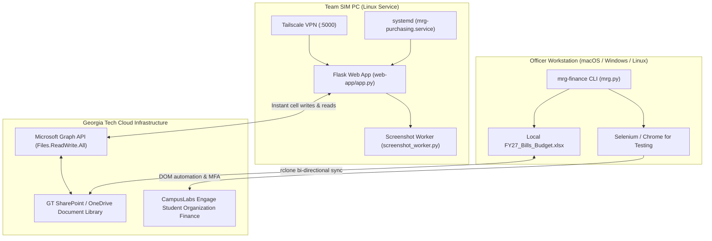

# 🛠️ Developer & System Architecture Guide

This guide covers system architecture, codebase design, Flask web dashboard deployment on the team SIM PC, and Microsoft Graph API integrations.

---

## 🏗️ 1. Architecture Overview



The system operates across two client interfaces connected via SharePoint:
1. **Web Dashboard (`web-app/`)**: Hosted 24/7 on the MRG Simulation PC, accessible on mobile/desktop via Tailscale at `http://<tailscale-ip>:5000`. Uses Microsoft Graph API to perform instant cell writes without locking the workbook.
2. **Command-Line Suite (`mrg.py`)**: Runs locally on officer laptops. Leverages headless or visible Selenium to process complex CampusLabs Engage submissions, build cart bundles, and scrape live quotes.

---

## 🖥️ 2. Web App Deployment (SIM PC)

### Setup & Installation
```bash
cd web-app
python3 -m venv .venv
source .venv/bin/activate
pip install -r requirements.txt
python app.py
```

### SharePoint Synchronization via `rclone`
```bash
rclone config
# Type: onedrive -> URL: https://gtvault.sharepoint.com/sites/MarineRoboticsGroup -> Documents
```

### systemd Service (`mrg-purchasing.service`)
```ini
[Unit]
Description=MRG Purchasing Web App
After=network.target

[Service]
Type=simple
User=awu335
WorkingDirectory=/home/awu335/mrg/finance/web-app
ExecStart=/home/awu335/mrg/finance/web-app/.venv/bin/gunicorn app:app --workers 3 --bind 0.0.0.0:5000 --timeout 120
Restart=always
RestartSec=5
Environment=PYTHONUNBUFFERED=1

# Resource limits - keep it lightweight for shared sim PC (Gazebo safe)
CPUQuota=25%
MemoryMax=512M
Nice=10

[Install]
WantedBy=multi-user.target
```

To enable and start:
```bash
sudo cp mrg-purchasing.service /etc/systemd/system/mrg-web-app.service
sudo systemctl daemon-reload
sudo systemctl enable mrg-web-app
sudo systemctl start mrg-web-app
```

---

## 🔑 3. Microsoft Graph API Specifications

- **Token Storage**: Cached in `~/.config/rclone/rclone.conf` (OAuth token generated by rclone).
- **Drive ID**: `b!N2jMdT_mCUGwm_kbNtcriy0U15MgYvlDp9Y3NuMGGZ4kw04Ai38XSIlj5IWhyCRr`
- **File ID**: `014676AIQHNE4YS3DICNEZLNSKL3YEEGA4`
- **Required Scopes**: `Files.ReadWrite.All`

### Cell-Level Patching
To protect formulas on `BillsT`:
- Web application writes must call `_patch_row_values()` in `xlsx_manager.py` to write individual cell values, explicitly skipping Column A (`Bill Item ID`) and Column K (`Total Cost`).
- For `TestTable` (the backlog queue without formulas), rows can be added using the standard `graph_add_row()` endpoint.

---

## 🗺️ 4. Code Map & Key Components

```text
finance/
├── mrg.py                     # Unified CLI entrypoint for mrg-finance
├── automation.py              # CampusLabs Engage bill submission automation
├── automation_purchase.py     # Purchase request form filler & order workflow
├── automation_screenshots.py  # Screenshot capture & price scraper integration
├── engage_bill_lookup.py      # DOM scraper for live Engage bills & line numbers
├── order_excel_builder.py     # Budget vs Quoted Excel generator with formulas
├── price_scraper.py           # Multi-vendor scraping (Amazon, McMaster, DigiKey)
├── review_server.py           # Local HTTP server (port 8321) for review GUI
├── review.html                # Side-by-side card visual inspection interface
├── share_a_cart.py            # Share-A-Cart API & extension integration
├── spreadsheet_utils.py       # Excel parser, table reader, link persistence
├── web-app/                   # Flask web dashboard (runs on SIM PC)
├── tests/                     # 32 pytest unit tests
└── docs/                      # Documentation suite
    ├── user/                  # End-user guides (Workflow & CLI)
    ├── dev/                   # Developer & architecture documentation
    └── agents/                # AI agent guidelines & changelog
```

### Key Functions
- **`lookup_bill_item_locations()`** (`engage_bill_lookup.py`): Navigates to an approved Engage bill URL and extracts exact section titles and line numbers for items.
- **`update_order_table_links()`** (`spreadsheet_utils.py`): Populates Columns U (`Share-A-Cart Link`) and V (`Engage Request Link`) across all rows matching an `Order ID` without modifying formulas.
- **`build_order_excel()`** (`order_excel_builder.py`): Dynamically builds the multi-bill `Budget_vs_Quoted_Detail` Excel report with formula subtotal references.

---

## 🧪 5. Testing & Validation

Run all unit tests using `uv`:
```bash
uv run pytest tests/
```

All 32 test suites verify:
- Flask route authorization and error handling (`test_app_routes.py`).
- Engage bill lookup and line matching (`test_engage_bill_lookup.py`).
- Excel report formula integrity (`test_order_excel_builder.py`).
- Vendor scraping & anti-bot parsing (`test_price_scraper.py`).
- CLI packaging and module declarations (`test_pyproject_packaging.py`).
- Share-A-Cart URL sanitization (`test_share_a_cart.py`).
- Local Excel and Graph API managers (`test_xlsx_manager.py`).
