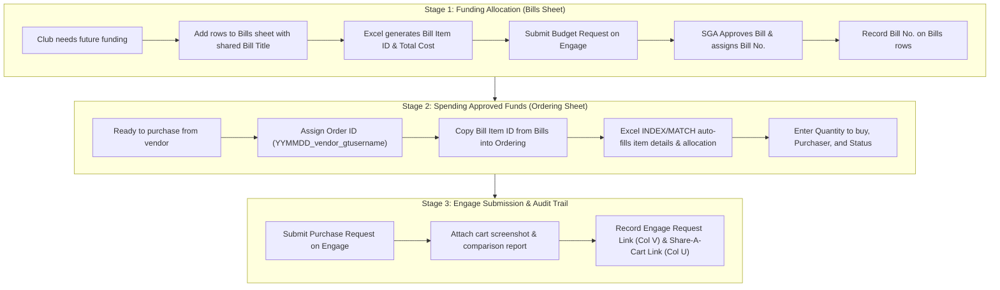

# 📊 Spreadsheet & Manual Workflow Guide

This guide is the complete reference for using **`FY27_Bills_Budget.xlsx` on SharePoint** and submitting funding or purchase requests directly through **CampusLabs Engage**.

---

## 🔄 1. The Tandem Lifecycle: How `Bills` and `Ordering` Work Together

The Georgia Tech Student Government Association (SGA) enforces a two-stage financial process. The spreadsheet mirrors this exact lifecycle across two sheets:

### Core Responsibilities

| Concept | `Bills` Sheet (`BillsT` table) | `Ordering` Sheet (`OrderT` table) |
| :--- | :--- | :--- |
| **Financial Meaning** | **Where the money comes from** (SGA approved budget). | **Where the money goes** (Specific vendor order). |
| **One row represents…** | A proposed product to be funded by SGA. | A product you are actively purchasing right now. |
| **Row Grouping Key** | **`Bill Title`** (e.g., `Marine Robotics Group RobotX Testing Equipment Bill`). | **`Order ID`** formatted as `YYMMDD_vendor_gtusername` (e.g., `260910_amazon_gburdell3`). |
| **Connecting Key** | Defines the unique **`Bill Item ID`** (e.g., `B03-01`). | References the **`Bill Item ID`** copied directly from `Bills`. |
| **Quantities** | Total quantity approved by SGA for the fiscal year. | Quantity being purchased in *this specific order* (must be $\le$ remaining allocation). |
| **Prices** | Approved budget unit price (must remain intact). | Live vendor quoted price (tracked in separate comparison report). |

---

## 📑 2. Spreadsheet Schema & Editing Rules

Open [FY27_Bills_Budget.xlsx on SharePoint](https://gtvault.sharepoint.com/:x:/r/sites/MarineRoboticsGroup/Shared%20Documents/OPS-1%20Operations/FY27%20Finances/FY27_Bills_Budget.xlsx?d=w89396907686c491395b64a5ef042181c&csf=1&web=1&e=b5knap) in your browser. Edit in Excel Online or Excel Desktop (with AutoSave on) and wait for your edits to save.

### A. The `Bills` Sheet (`BillsT` Table)

Used when preparing an SGA Bill Request for funding.

| Column | Field Name | Type | Editing Instructions |
| :--- | :--- | :--- | :--- |
| **A** | **`Bill Item ID`** | **Formula** | **DO NOT OVERWRITE.** Generated automatically by Excel formula. |
| **B** | `Bill No.` | Text/Number | Leave blank initially. Once SGA passes the bill, enter the official Engage request number (e.g. `344042`) on all rows for this bill. |
| **C** | `Bill Title` | Text | The shared bill name. Use identical text across all rows in the same request. |
| **D** | `Item Name` | Text | Clear, concise item name (e.g. `Pi Pico`, `M2.5 Threaded Inserts`). |
| **E** | `Vendor` | Text | Primary vendor (e.g. `Amazon`, `McMaster`, `DigiKey`). |
| **F** | `Description` | Text | Brief justification of how the item supports the team. |
| **G** | `Budget Section` | Dropdown/Text | SGA category: `B03 - General Inventoried Goods` (assets/tools) or `B06 - Non-Inventoried Items` (consumables/supplies). |
| **H** | `Quantity` | Number | Quantity to request. |
| **I** | `Cost` | Currency | Price of **one unit or pack** (e.g. enter `$12.50` for a pack of 10, not the total extended cost). |
| **K** | **`Total Cost`** | **Formula** | **DO NOT OVERWRITE.** Calculated as `=Quantity * Cost`. |
| **L** | `Link` | URL | Direct link to the vendor product page for screenshot verification. |
| **M** | `Person Requesting` | Text | Your name / GT username. |
| **N** | `Status` | Text | `Draft`, `Submitted`, or `Approved`. |

### B. The `Ordering` Sheet (`OrderT` Table)

Used when arranging an approved purchase. Note: Row 1 contains summary subtotals; Row 2 contains column headers; **data begins on Row 3**.

| Column | Field Name | Type | Editing Instructions |
| :--- | :--- | :--- | :--- |
| **A** | `Order ID (YYMMDD_vendor_gburdell3)` | Text | Enter the order's identifier, e.g. `260910_amazon_gburdell3`. Repeat on all rows in this order. |
| **B** | **`Bill Item ID`** | **Input** | **Copy and paste from Column A of `Bills`.** This single value drives all lookup formulas. |
| **C–G** | `Bill No.`, `Bill Title`, `Item Name`, `Vendor`, `Cost` | **Calculated** | **DO NOT OVERWRITE.** Populated automatically via `=INDEX(MATCH(...))` looking into `BillsT`. |
| **H** | `Quantity` | Number | Enter the quantity being purchased in this order. |
| **I** | `Total Cost` | **Calculated** | **DO NOT OVERWRITE.** Extended order cost based on budget cost. |
| **J** | `Allocation` | **Calculated** | **DO NOT OVERWRITE.** Total amount approved on the source bill. |
| **K** | `Purchaser` | Text | Name of the person coordinating the order. |
| **L** | `Status` | Text | `Pending`, `Ordered`, `Delivered`, or `Reimbursed`. |
| **O** | `Budget Section` | **Calculated** | **DO NOT OVERWRITE.** Pulled from the source bill item. |
| **U** | `Share-A-Cart Link` | URL | Link generated from vendor cart (e.g. Share-A-Cart). **Paste on every row sharing this Order ID.** |
| **V** | `Engage Request Link` | URL | URL of the submitted Engage purchase request. **Paste on every row sharing this Order ID.** |

> [!IMPORTANT]
> **Formula Integrity**: Never paste entire rows or cut-and-paste cells across tables. Pasting plain text over formula cells breaks automatic lookups and corrupts totals. If a cell shows `#N/A` or `#VALUE!`, check that the copied `Bill Item ID` matches the source row exactly and that there are no accidental trailing spaces.

---

## 📝 3. Manual Engage Submission Reference

If you are not using the automated CLI tool, follow these step-by-step instructions to submit directly in CampusLabs Engage.

### A. Submitting a Budget / Bill Request (Funding Approval)

1. **Open Engage Budgeting:** Navigate to [MRG Budgeting in Engage](https://gatech.campuslabs.com/engage/actionCenter/organization/MRG/budgeting) and log in with your GT account and Duo MFA.
2. **Create Draft:** Click **Create Request**, select the upcoming fiscal year (e.g., `FY27`), and set the request name to the exact **`Bill Title`** used in Excel.
3. **Add Line Items by Section:**
   - Group items under the correct budget section (`B03` or `B06`).
   - For each item, enter the `Item Name`, `Description` (justification), `Quantity`, and unit `Cost`.
   - **Attach Quote Screenshot:** Upload a clear PNG screenshot (`screenshots/<Bill Title>/<Item Name>.png`) showing the product name, variant/pack size, and live price.
4. **Verify Totals & Submit:** Confirm the total requested amount matches Excel's subtotal for that bill title. Click **Submit**.
5. **Update Excel:** Once submitted, copy the assigned request number into `Bill No.` on the `Bills` sheet for all items in that bill.

### B. Submitting a Purchase Request (Spending Approved Funds)

1. **Verify Funding:** Confirm that the bill is marked `Approved` by SGA and that you have sufficient remaining allocation.
2. **Build Vendor Cart & Gather Evidence:**
   - Add the exact products and quantities to your cart on the vendor website.
   - Take a clear screenshot of the cart showing items, quantities, and estimated total (`screenshots/<Order ID>/cart.png`).
   - Generate a Share-A-Cart link if available.
3. **Create Budget vs Quoted Comparison Spreadsheet:**
   - Create a separate Excel workbook titled `Budget_vs_Quoted_Detail_<Order ID>.xlsx`.
   - Required columns:
     - `Item Name`
     - `Engage Reference` (e.g., `Bill 344042, Line 34`)
     - `Approved Unit Cost`, `Approved Quantity`, `Approved Total`
     - `Quoted Unit Cost`, `Quoted Quantity`, `Quoted Total`
     - `Difference` (`Quoted Total - Approved Total`)
   - Reconcile shipping and tax separately.
4. **Complete Engage Form:**
   - Navigate to [Create Purchase Request](https://gatech.campuslabs.com/engage/actionCenter/organization/MRG/Finance/CreatePurchaseRequest).
   - **Subject:** Format as `Marine Robotics Group <Vendor> Purchase Request <YYYY-MM-DD>`.
   - **Requested Amount:** Total amount being charged to the card (including shipping/tax).
   - **Description:** Order summary and the Share-A-Cart link.
   - **Category / Account:** Select the designated funding account (consult the finance officer if unsure).
   - **Budget/Bill # and Request Line #:** List each item's verified reference in the approved bill (e.g. `Bill 344042, Line 34`). *Note: Engage line numbers must be checked on the approved Engage bill; they are NOT Excel row numbers.*
   - **SGA Breakdown:** State the amount per line and budget section (e.g., `$49.95, Line 34, Bill 344042, B06 - Non-Inventoried Items`).
   - **Attachments:** Upload `cart.png` and `Budget_vs_Quoted_Detail_<Order ID>.xlsx`.
   - **Signature:** Enter your full name and submit.
5. **Record URLs in Excel:**
   - Copy the URL of the submitted purchase request into Column V (**`Engage Request Link`**) on **every row** with that `Order ID` in `Ordering`.
   - Copy the cart link into Column U (**`Share-A-Cart Link`**) on those same rows.

---

## 🩺 4. Spreadsheet Validation & Diagnostics

If you have the CLI installed, you can run `mrg-finance doctor` to validate workbook integrity.

### What `doctor` Validates:
- Readability of `FY27_Bills_Budget.xlsx`.
- Existence of `Bills` and `Ordering` sheets.
- Duplicate `Bill Item ID` values in `Bills`.
- Missing item names, missing bill numbers, or nonpositive costs.
- Malformed product URLs.
- Broken foreign key references (Order rows referencing non-existent `Bill Item ID`s).

### What Must Be Verified Manually:
- Sufficient remaining spending authority.
- Live vendor availability and stock.
- Correct Engage line numbers on approved bills.
- Inclusion of tax and shipping in funding requests.
